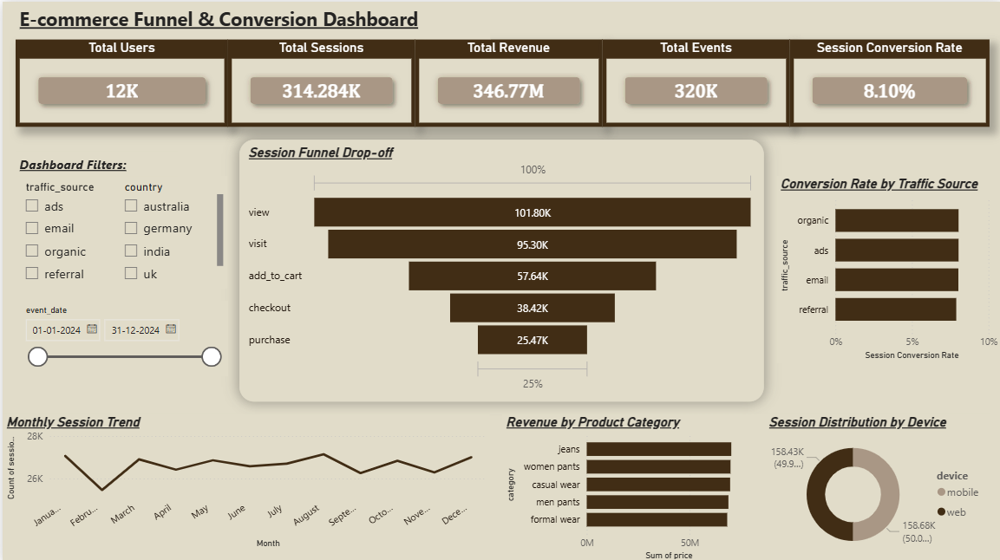
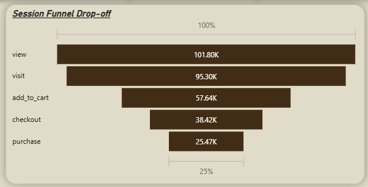

# E-Commerce Product Analytics Case Study

## Overview

This project analyzes 310K+ ecommerce user events to understand user behavior, funnel
progression, conversion patterns, and product performance. The goal was to identify where
users drop off in the purchase journey and generate actionable product insights using
Python, SQL, and Power BI.

---

## Objectives

- Analyze user funnel progression from visit to purchase
- Measure session level conversion and drop-off rates
- Perform root cause analysis (RCA) across multiple user segments
- Identify high friction stages in the funnel
- Build an interactive business dashboard for stakeholder reporting

---

## Dataset

Synthetic ecommerce product analytics dataset containing:

- 310K+ event-level user interactions
- 12K+ unique users
- 32k rows
- Multiple traffic sources, devices, countries, and product categories
- Funnel events: visit → view → add_to_cart → checkout → purchase

---

## Tools & Technologies

- Python (Pandas, Matplotlib)
- SQL (SQLite)
- Power BI
- Jupyter Notebook
- Git & GitHub

---

## Key Analyses Performed

### Data Cleaning & Validation

- Standardized categorical fields and parsed timestamps
- Flagged invalid prices and bad timestamps, also preserved empty price when event is only visited
- Created derived columns: event_hour, day_of_week, time_of_day, month

### Funnel Analysis

- Built session-level funnel progression using max step reached per session
- Measured conversion and drop-off rates at each funnel stage
- Identified checkout-to-purchase (60% drop-off) as the highest abandonment stage

### Root Cause Analysis (RCA)

Segmented funnel drop-off across:

- Traffic source
- Device type
- Country and city
- Product category
- Day of week and time of day
- Monthly trends

### SQL Analytics

Used SQLite queries to:

- Calculate purchase conversion rates by traffic source
- Analyze category wise and device-wise performance
- Track monthly session trends and MoM changes

### Power BI Dashboard

Built an interactive dashboard featuring:

- KPI cards
- Session funnel visualization
- Traffic source conversion analysis
- Monthly session trend analysis
- Category and device distribution metrics
- Interactive filters

---

## Key Findings

- The highest drop-off occurred between checkout and purchase (60% drop-off rate).
- RCA across traffic source, device, geography, product category, and time patterns
  showed no meaningful variance confirming the drop-off is systemic and platform-wide.
- A significant session count anomaly was observed in February, affecting all segments
  equally, suggesting a platform level event during that period.
- No single user segment was disproportionately responsible for funnel degradation.

---

## Recommendations

## Recommendations

- The February session drop-off was uniform across all segments no single traffic source,
  device, or geography was disproportionately affected. This points to a higher-level
  platform or external factor (such as a global outage, market event, or infrastructure
  change) rather than a product-specific issue.
- Any future platform-wide changes such as checkout flow redesigns, pricing updates, or
  UI changes — should be validated through A/B testing before full rollout to avoid
  introducing systemic friction that affects all users simultaneously.
- Improve the overall checkout experience to reduce the 60% final stage abandonment rate.
- Monitor monthly session trends to detect anomalies early before they compound.

---

## Dashboard Preview




## Project Structure

```text
product-analytics-project/
│
├── data/
├── notebooks/
├── visuals/
├── powerbi/
├── README.md
└── .gitignore
```

p.s- Sql can be found in the notebook itself.
And data contains unmodified csv file, cleaned csv file and DB of cleaned csv.

---

## Author

Ananya Modem
